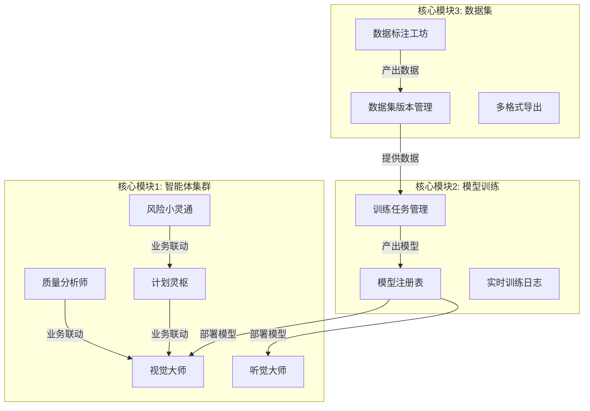
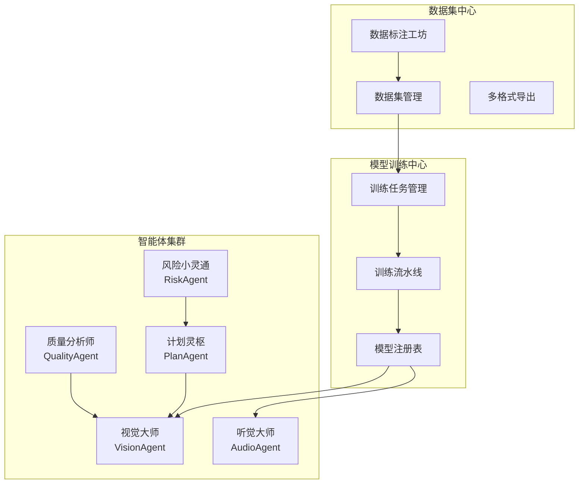
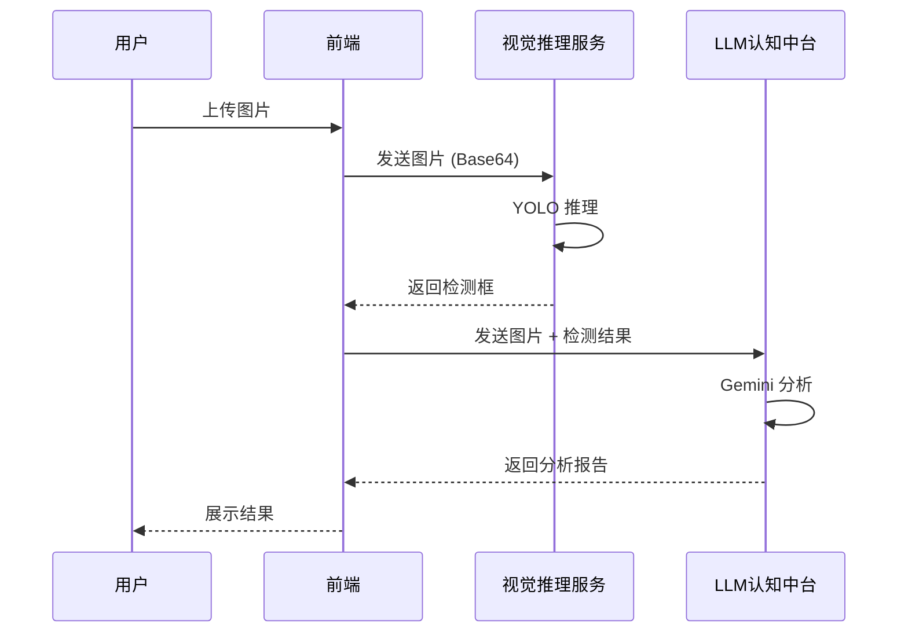
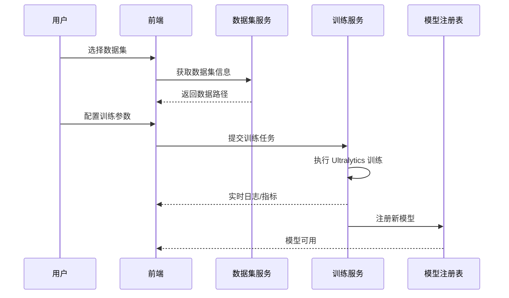
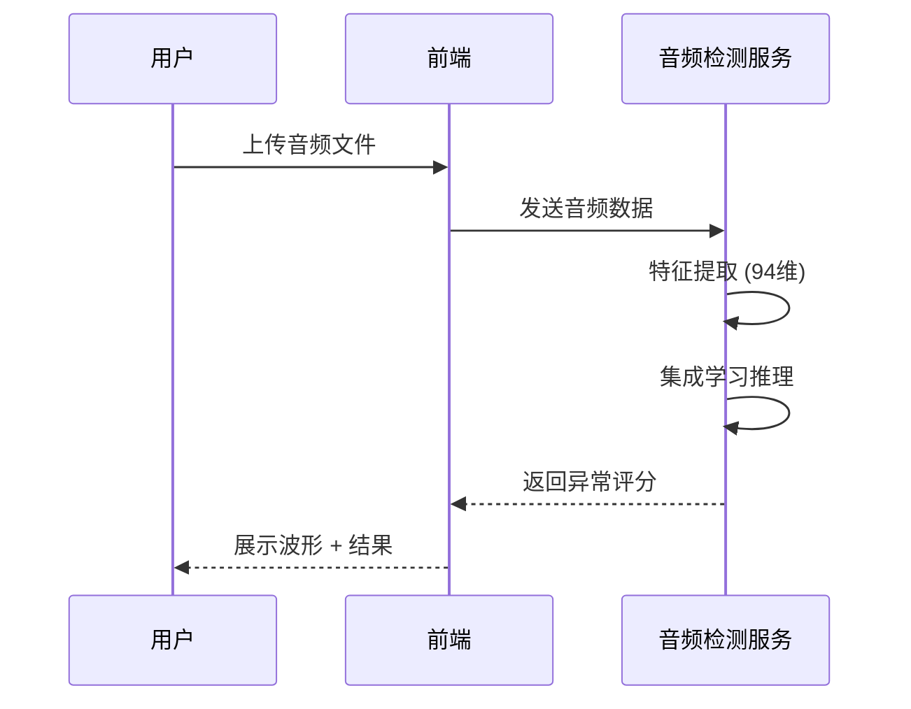
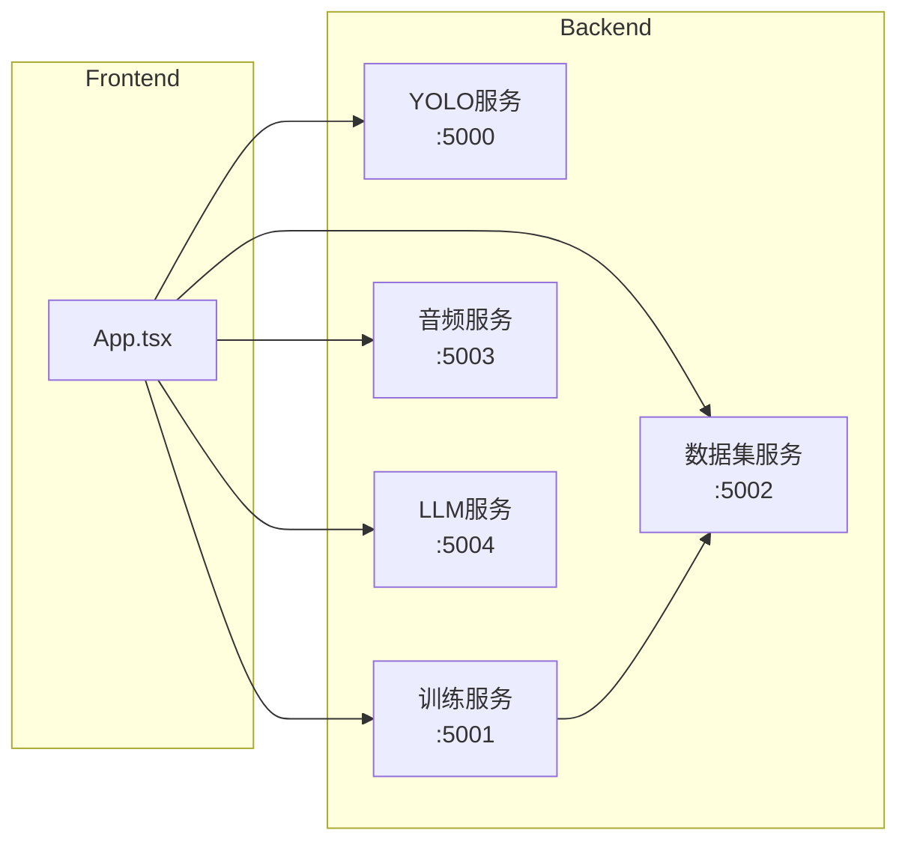

# 智能体协作平台 - 完整文档

> **版本**: v3.3  
> **更新日期**: 2026-02-02  
> **状态**: 生产就绪 (Production Ready)

---

## 目录

1. [项目概述](#一项目概述)
2. [技术架构](#二技术架构)
3. [部署指南](#三部署指南)
4. [功能使用指南](#四功能使用指南)
5. [技术特性详解](#五技术特性详解)
6. [听觉测试模型工具](#六听觉测试模型工具)
7. [测试检查清单](#七测试检查清单)

---

# 一、项目概述

本平台采用**三大核心模块架构**，实现了从数据生产、模型训练到智能体应用的全链路闭环。

## 1.1 核心架构概览

平台由以下三个顶级模块构成：

1. **智能体集群 (Intelligent Agent Cluster)**: 5大业务智能体，负责具体的业务逻辑与交互
2. **模型训练中心 (Model Training Center)**: 负责算法模型的全生命周期管理
3. **数据集中心 (Dataset Center)**: 负责数据标注、管理与版本控制



## 1.2 目录结构与实现方案

代码库结构严格对应三大架构模块，确保高内聚低耦合。

### 模块一：智能体集群 (Agent Cluster)

负责感知、决策与执行的业务闭环。

- **前端实现 (Frontend)**: `components/agents/`
  - `VisionAgent.tsx`: 视觉检测交互主界面
  - `AudioAgent.tsx`: 音频波形渲染与诊断面板
  - `PlanAgent.tsx`: 供应链甘特图与MRP计算
  - `QualityAgent.tsx`: 质量流程 (Hold/CR/QR) 管理
  - `RiskAgent.tsx`: 供应链风险地图渲染

- **后端微服务 (Microservices)**:
  - `model/server.py`: **视觉推理服务** (YOLOv8/11, Port 5000)
  - `training/audio_detection_server.py`: **音频算法服务** (Ensemble, Port 5003)
  - `training/llm_analysis_server.py`: **认知中台服务** (LLM Gateway, Port 5004)

### 模块二：模型训练中心 (Training Center)

负责模型的持续学习与迭代。

- **前端组件**: `components/training/`
  - `TrainingQueue.tsx`: 训练任务队列视窗
  - `TrainingVisualization.tsx`: 实时 Loss/mAP 曲线
  
- **后端核心**: `training/`
  - `train_server.py`: **训练管理服务** (Port 5001)，负责任务调度
  - `train_pipeline.py`: 封装 Ultralytics 训练流水线
  - `models_registry.json`: 模型版本与元数据注册表

### 模块三：数据集中心 (Dataset Center)

负责高质量数据的生产与沉淀。

- **前端组件**:
  - `components/agents/DataAnnotationAgent.tsx`: 标注工作台入口
  - `components/DataAnnotation/`: 标注工具底层组件 (Canvas, Tools)
  - `services/exportUtils.ts`: 数据格式转换逻辑 (COCO/YOLO/VOC)

- **后端核心**:
  - `training/dataset_server.py`: **数据集服务** (Port 5002)，负责文件系统管理

## 1.3 模块功能详解

### 1. 视觉大师 (Vision Agent)
- **定位**: 工业外观质检专家
- **能力**: 基于 YOLOv8/v11 的实时缺陷检测
- **场景**: 漆面划痕、凹坑、异物检测
- **交互**: 支持摄像头实时流与批量图片上传检测

### 2. 听觉大师 (Audio Agent)
- **定位**: 设备故障诊断专家
- **能力**: 基于集成学习 (Ensemble Learning) 的异响检测
- **场景**: 工业设备运转噪音分析、NVH 评估
- **特性**: 实时波形显示与异常评分 (0-100)

### 3. 计划灵枢 (Plan Agent)
- **定位**: 供应链排程专家
- **能力**: 智能 MPS (主生产计划) 与 MRP (物料需求计划) 计算
- **特性**: 
    - 产线甘特图可视化
    - 缺料自动预警
    - 交互式催单与排程调整

### 4. 质量分析师 (Quality Agent)
- **定位**: 全流程质量管控专家
- **能力**: 质量数据的深度分析与流程管理
- **特性**:
    - **Hold 管理**: 异常批次的冻结与释放
    - **CR/QR 管理**: 客户投诉与质量风险的 8D 闭环跟踪
    - **供应商画像**: 基于质量表现的动态评级

### 5. 风险小灵通 (Risk Agent)
- **定位**: 供应链风控专家
- **能力**: 全球供应链风险监控与 BIA (业务影响分析)
- **特性**: 
    - **GIS 风险地图**: 可视化展示 T1-T3 供应商分布与风险点
    - **多维预警**: 涵盖经营、质量、地缘、灾害四类风险

## 1.4 快速启动

```bash
chmod +x start.sh
./start.sh
```

**服务清单**:
- **前端门户**: `http://localhost:3000`
- **视觉推理**: `:5000`
- **训练服务**: `:5001`
- **数据服务**: `:5002`
- **音频服务**: `:5003`
- **认知中台**: `:5004` (为 Plan/Quality/Risk 提供 LLM 支持)

---

# 二、技术架构

## 2.1 系统总体架构

平台采用三大核心模块架构，实现从数据生产、模型训练到智能体应用的全链路闭环。



## 2.2 技术栈

### 前端技术

| 技术 | 版本 | 用途 |
|------|------|------|
| React | 18.x | UI 框架 |
| TypeScript | 5.x | 类型安全 |
| Vite | 5.x | 构建工具 |
| Zustand | 4.x | 状态管理 |
| Konva | 9.x | Canvas 画布渲染 |
| Lucide React | - | 图标库 |

### 后端技术

| 技术 | 版本 | 用途 |
|------|------|------|
| Python | 3.10+ | 后端语言 |
| Flask | 3.x | Web 框架 |
| Ultralytics | 8.x | YOLO 模型训练 |
| Scikit-learn | 1.x | 集成学习模型 |
| Librosa | 0.10+ | 音频特征提取 |

### AI/ML 模型

| 模型 | 用途 |
|------|------|
| YOLOv8/v11 | 视觉缺陷检测 |
| Ensemble (SVM + IF + LOF) | 音频异常检测 |
| Google Gemini | LLM 认知分析 |

## 2.3 服务端口映射

| 端口 | 服务 | 说明 |
|------|------|------|
| 3000 | Frontend | 前端门户 |
| 5000 | model/server.py | 视觉推理服务 (YOLO) |
| 5001 | training/train_server.py | 训练管理服务 |
| 5002 | training/dataset_server.py | 数据集服务 |
| 5003 | training/audio_detection_server.py | 音频检测服务 |
| 5004 | training/llm_analysis_server.py | LLM 认知中台 |

## 2.4 目录结构

```
智能体协作平台/
├── api/                        # Vercel Serverless API 路由
│   ├── audio/                  # 音频检测 API
│   ├── datasets/               # 数据集 API
│   ├── detect/                 # 检测 API
│   └── llm/                    # LLM 分析 API
│
├── components/                 # React 组件
│   ├── agents/                 # 5大智能体组件
│   │   ├── VisionAgent.tsx     # 视觉大师
│   │   ├── AudioAgent.tsx      # 听觉大师
│   │   ├── PlanAgent.tsx       # 计划灵枢
│   │   ├── QualityAgent.tsx    # 质量分析师
│   │   ├── RiskAgent.tsx       # 风险小灵通
│   │   └── DataAnnotationAgent.tsx  # 数据标注入口
│   │
│   ├── annotation/             # 标注工具核心组件
│   ├── audio/                  # 音频相关组件
│   ├── training/               # 训练相关组件
│   └── DataAnnotation/         # 数据标注 UI 组件
│
├── config/                     # 前端配置
├── covers/                     # 智能体封面图
├── public/                     # 静态资源
│
├── model/                      # 视觉模型服务
│   ├── server.py               # YOLO 推理服务
│   ├── models/                 # 已部署模型
│   └── audio_models/           # 音频模型配置
│
├── services/                   # 前端服务层
│   ├── gemini.ts               # Gemini API 调用
│   └── exportUtils.ts          # 数据导出工具
│
├── store/                      # Zustand 状态管理
│   ├── useAnnotationStore.ts   # 标注状态
│   ├── useDatasetStore.ts      # 数据集状态
│   ├── useInferenceStore.ts    # 推理状态
│   └── useTrainingStore.ts     # 训练状态
│
├── training/                   # 训练服务后端
│   ├── train_server.py         # 训练管理服务
│   ├── train_pipeline.py       # 训练流水线
│   ├── dataset_server.py       # 数据集服务
│   ├── audio_detection_server.py   # 音频检测服务
│   ├── audio_inference_server.py   # 音频推理服务
│   ├── llm_analysis_server.py  # LLM 分析服务
│   ├── models_registry.json    # 模型注册表
│   └── audio_training/         # 音频训练模块
│
├── types/                      # TypeScript 类型定义
├── utils/                      # 工具函数
├── 听觉测试模型/                # 音频检测独立工具
├── 业务标准/                    # 业务标准文档
│
├── App.tsx                     # 应用入口组件
├── index.tsx                   # React 入口
├── package.json                # 依赖配置
└── vite.config.js              # Vite 配置
```

## 2.5 数据流图

### 视觉检测流程



### 模型训练流程



### 音频检测流程



## 2.6 模块依赖关系

### 智能体依赖

| 智能体 | 依赖服务 |
|--------|----------|
| 视觉大师 | YOLO服务 (5000), LLM服务 (5004) |
| 听觉大师 | 音频检测服务 (5003) |
| 计划灵枢 | LLM服务 (5004) |
| 质量分析师 | LLM服务 (5004) |
| 风险小灵通 | LLM服务 (5004) |

### 服务依赖



## 2.7 环境配置

### 环境变量

```bash
# .env.example
GEMINI_API_KEY=your_gemini_api_key
YOLO_MODEL_PATH=./model/models/paint/best.pt
AUDIO_MODEL_PATH=./training/audio_training/models/
```

### 启动命令

```bash
# 一键启动所有服务
chmod +x start.sh
./start.sh

# 单独启动前端
npm run dev

# 单独启动后端服务
python model/server.py          # 视觉推理
python training/train_server.py # 训练服务
python training/dataset_server.py # 数据集服务
python training/audio_detection_server.py # 音频检测
python training/llm_analysis_server.py # LLM服务
```

## 2.8 扩展说明

### 添加新智能体

1. 在 `components/agents/` 创建 `NewAgent.tsx`
2. 在 `App.tsx` 注册路由
3. 在 `covers/` 添加封面图
4. 更新 `metadata.json`

### 添加新模型

1. 训练模型并导出 `.pt` 文件
2. 在 `training/models_registry.json` 注册
3. 前端自动识别可用模型

### 数据格式支持

- **导入**: YOLO, COCO, VOC
- **导出**: YOLO, COCO, VOC, ZIP

## 2.9 性能指标

| 服务 | 响应时间 | 备注 |
|------|----------|------|
| YOLO 推理 | < 100ms | 单张图片 |
| LLM 分析 | 2-5s | 取决于 Gemini 响应 |
| 音频检测 | < 500ms | 单个音频文件 |
| 训练任务 | 10min+ | 取决于数据集大小 |

---

# 三、部署指南

本项目采用混合部署架构：
- **前端 + 轻量级 API**：部署到 Vercel
- **训练服务**：部署到 Railway

## 3.1 Vercel 部署（前端 + API）

### 准备工作

1. 注册 [Vercel](https://vercel.com) 账号
2. 安装 Vercel CLI（可选）：
   ```bash
   npm i -g vercel
   ```

### 部署步骤

#### 方式一：通过 Git 仓库

1. 将代码推送到 GitHub/GitLab/Bitbucket
2. 在 Vercel Dashboard 中导入项目
3. Vercel 会自动检测 Vite 项目并配置构建

#### 方式二：通过 CLI

```bash
cd /path/to/project
vercel
```

### 配置环境变量

在 Vercel Dashboard → Project → Settings → Environment Variables 中添加：

| 变量名 | 值 | 说明 |
|--------|-----|------|
| `VITE_TRAINING_API` | `https://your-railway-app.railway.app` | Railway 训练服务地址 |
| `LLM_BASE_URL` | `https://liai-app.chj.cloud/v1` | LLM API 地址 |
| `LLM_API_KEY` | `app-xxx` | LLM API 密钥 |
| `BLOB_READ_WRITE_TOKEN` | `vercel_blob_xxx` | Vercel Blob 令牌（可选） |

### 配置 Vercel Blob（可选）

如需使用数据集管理功能：

1. 在 Vercel Dashboard → Storage → Create → Blob
2. 复制生成的 `BLOB_READ_WRITE_TOKEN`
3. 添加到环境变量

## 3.2 Railway 部署（训练服务）

### 准备工作

1. 注册 [Railway](https://railway.app) 账号
2. 安装 Railway CLI（可选）：
   ```bash
   npm i -g @railway/cli
   ```

### 部署步骤

#### 方式一：通过 Dashboard

1. 在 Railway Dashboard 中点击 "New Project"
2. 选择 "Deploy from GitHub repo" 或 "Empty Project"
3. 如果是空项目，使用 CLI 部署：
   ```bash
   railway login
   railway init
   railway up
   ```

#### 方式二：通过 CLI

```bash
cd /path/to/project
railway login
railway init
railway up
```

### 配置持久化存储

训练服务需要持久化存储来保存模型和数据集：

1. 在 Railway Dashboard → Project → Service → Settings
2. 添加 Volume：
   - Mount Path: `/app/training/runs`（训练结果）
   - Mount Path: `/app/training/datasets`（数据集）

## 3.3 部署验证

### 验证 Vercel

访问 Vercel 部署的 URL，检查：
- [ ] 前端页面正常加载
- [ ] 导航和路由正常工作

### 验证 Railway

访问 Railway 服务 URL：
```bash
curl https://your-railway-app.railway.app/train/status
```

应返回训练状态 JSON。

### 验证服务连通性

在前端尝试：
- [ ] 启动训练任务
- [ ] 查看训练状态
- [ ] 使用 LLM 分析功能

## 3.4 故障排除

### Vercel 相关

1. **构建失败**
   - 检查 `package.json` 中的依赖版本
   - 查看 Vercel 构建日志

2. **API 调用 404**
   - 检查 `vercel.json` 的 rewrites 配置
   - 确认 `api/` 目录下的函数文件存在

3. **YOLO/音频服务不可用**
   - 需要 Vercel Pro 版本
   - 检查模型文件是否已上传到 Blob

### Railway 相关

1. **部署失败**
   - 检查 `training/requirements.txt` 依赖
   - 查看 Railway 部署日志

2. **训练失败**
   - 检查 Volume 是否正确挂载
   - 查看训练服务日志

3. **跨域错误**
   - 训练服务已配置 `CORS(app)`，允许所有来源

## 3.5 费用说明

### Vercel

- **Hobby（免费）**：适合测试，Serverless 执行时间限制 10s
- **Pro（$20/月）**：推荐，执行时间 60s，支持 YOLO 推理

### Railway

- **Hobby（免费）**：500 小时/月，适合轻度使用
- **Pro（$5/月起）**：按使用量计费，适合频繁训练

## 3.6 架构图

```
┌─────────────────────────────────────────────────────┐
│                     用户浏览器                        │
└─────────────────────┬───────────────────────────────┘
                      │
        ┌─────────────┴─────────────┐
        ▼                           ▼
┌───────────────────┐       ┌───────────────────┐
│      Vercel       │       │     Railway       │
├───────────────────┤       ├───────────────────┤
│  前端静态资源      │       │   训练服务         │
│  /api/llm/*       │       │   - 模型训练       │
│  /api/datasets/*  │       │   - 训练队列       │
│  /api/detect/*    │       │   - 模型管理       │
│  /api/audio/*     │       │                   │
├───────────────────┤       ├───────────────────┤
│  Vercel Blob      │       │  Volume (持久化)  │
│  (模型/数据集)     │       │  (训练结果/数据)   │
└───────────────────┘       └───────────────────┘
```

---

# 四、功能使用指南

## 4.1 听觉大师使用指南

### 快速开始

#### 第一步：训练模型
1. 进入"模型训练中心"
2. 切换到"听觉异响检测"项目
3. 准备至少20个已标注的音频样本
4. 点击"开始训练"

#### 第二步：部署模型
1. 训练完成后，在"模型管理"找到新训练的模型
2. 点击"部署"按钮
3. 模型自动部署到听觉大师

#### 第三步：使用听觉大师
1. 打开"听觉大师"页面
2. 确认顶部显示"部署模型: 音频异常检测_xxx"
3. 上传 .wav 音频文件
4. 自动使用最新部署的模型进行检测

### 重要说明

**改进内容**:
- **无需选择模型**：模型在训练中心部署后自动生效
- **简化流程**：训练 → 部署 → 使用
- **避免错误**：不会选择错误的模型版本

**注意事项**:
1. **必须先部署模型**：如果未部署，听觉大师会提示"未部署"
2. **只有一个生效模型**：新部署的模型会覆盖旧模型
3. **自动重载**：部署后无需重启服务，模型自动生效

### 更新模型

想使用新训练的模型？只需要：
1. 在训练中心训练新模型
2. 点击"部署"
3. 听觉大师立即使用新模型

### 查看模型信息

在听觉大师页面顶部可以看到：
- **部署模型名称**：显示当前使用的模型
- **模型准确率**：显示在指标卡片中
- **部署时间**：最后部署的时间

### 常见问题

**Q: 为什么上传按钮是灰色的？**
A: 请先在训练中心部署模型

**Q: 如何切换使用不同的模型？**
A: 在训练中心选择要使用的模型，点击"部署"即可

**Q: 部署新模型后需要刷新页面吗？**
A: 不需要，模型会自动生效（等待30秒自动更新）

## 4.2 音频模型推理快速指南

### 新架构
```
前端 → train_server(5001) → audio_inference_server(5005) → 返回结果
```

### 启动服务

```bash
cd /path/to/project/training

# 一键启动
./start_audio_services.sh

# 或手动启动
python3 audio_inference_server.py --port 5005 &
python3 train_server.py --port 5001 &
```

### 检查服务状态

```bash
# 查看进程
ps aux | grep -E "audio_inference|train_server" | grep python3

# 测试健康检查
curl http://localhost:5005/health

# 测试检测功能
curl -X POST http://localhost:5001/api/audio/detect \
  -F "audio=@test.wav" \
  -F "model_id=test"
```

## 4.3 批量评测功能使用指南

### 功能概述

模型测试模块支持批量评测功能，可以一次性上传多个文件进行检测：
- **视觉缺陷检测**：批量测试多张图片
- **音频异响检测**：批量测试多个音频文件

### 使用步骤

1. **进入模型测试页面**：导航到 **模型训练中心** → **模型测试** 模块

2. **选择测试模式**：
   - **单图/单文件测试**：逐个测试文件
   - **批量评测**：批量上传多个文件同时测试

3. **选择模型**：
   - 视觉缺陷检测：选择视觉模型（YOLOv8/YOLO11）
   - 音频异响检测：选择音频模型

4. **批量上传文件**：
   - **视觉检测**：支持 JPG、PNG、BMP 格式
   - **音频检测**：支持 WAV 格式

5. **开始批量测试**：点击 **开始批量测试** 按钮

6. **查看测试结果**：
   - 视觉检测：文件名、检测数量、状态
   - 音频检测：文件名、是否异常、异常得分、置信度、级别

7. **导出结果**：点击 **导出CSV** 按钮导出结果

### 技术实现

#### 视觉批量评测 API
```
POST http://localhost:5001/evaluate/batch

请求体：
{
  "model_id": "模型ID",
  "images": [
    {
      "id": "image_0",
      "filename": "test1.jpg",
      "image": "base64编码的图片数据"
    }
  ],
  "confidence": 0.25
}
```

#### 音频批量评测 API
```
POST http://localhost:5001/api/audio/evaluate/batch

请求体：
{
  "model_id": "模型ID",
  "audio_files": [
    {
      "id": "audio_0",
      "filename": "test1.wav",
      "audio": "base64编码的音频数据"
    }
  ]
}
```

### 注意事项

1. **文件数量限制**：建议单次不超过100个文件
2. **文件大小**：单个文件不超过10MB
3. **模型选择**：确保已选择正确类型的模型
4. **置信度阈值**：视觉检测支持调整置信度阈值（0.1-0.9）
5. **导出结果**：CSV使用UTF-8编码

---

# 五、技术特性详解

## 5.1 阈值刷新功能

### 功能概述

用户可以调整灵敏度阈值后，无需重新上传音频文件或重新运行模型推理，即可根据新阈值重新计算所有历史记录的判定结果。

### 核心概念

1. **score（异常得分）保持不变**
   - score 是模型推理的原始输出，范围 0-1
   - score 越高 = 音频越正常

2. **阈值控制判定边界**
   - 灵敏度参数（0-100%）
   - 灵敏度越高 → 越容易判定为异常
   - 转换公式：`normalityThreshold = 1 - (sensitivity / 100)`

3. **重新计算判定结果**
   - 根据 `score < normalityThreshold` 判定是否异常
   - 更新 `is_abnormal`、`status`、`confidence`、`level`

### 使用方法

1. **上传音频文件**：上传 .wav 音频文件
2. **查看初始结果**：查看检测结果和异常数量
3. **调整灵敏度**：拖动滑块（0-100%），显示"应用阈值"按钮
4. **应用新阈值**：点击按钮，所有历史记录立即更新

### 阈值效果示例

| 灵敏度 | 异常数量 | 正常数量 | 正常率 |
|--------|---------|---------|-------|
| 30%    | 5       | 2       | 28.6% |
| 50%    | 4       | 3       | 42.9% |
| 70%    | 2       | 5       | 71.4% |
| 90%    | 0       | 7       | 100%  |

### 判定逻辑

#### 异常状态
- Score < 0.3 → **严重异常** (CRITICAL)
- Score < 0.4 → **明显异常** (HIGH)
- 其他异常 → **中度异常** (MEDIUM)

#### 正常状态
- Score > 0.7 → **完全正常** (PERFECT)
- Score > 0.5 → **基本正常** (NORMAL)
- 其他正常 → **可疑** (SUSPICIOUS)

### 性能优势

| 场景 | 文件数 | 传统方式 | 新功能 |
|------|--------|---------|--------|
| 小规模 | 10个 | ~30秒 | < 0.1秒 |
| 中规模 | 50个 | ~2.5分钟 | < 0.2秒 |
| 大规模 | 100个 | ~5分钟 | < 0.5秒 |

## 5.2 灵敏度输入框功能

### 功能改进

为听觉大师和视觉大师的灵敏度控制添加了**数字输入框**：
- 拖动滑块调整灵敏度（原有功能）
- **直接输入数字精确设置**（新功能）

### 交互逻辑

1. **滑块拖动** → 输入框自动更新
2. **输入框修改** → 滑块位置自动同步
3. **数值验证** → 自动限制在 0-100 范围
4. **失焦恢复** → 空值时恢复到当前值

### 输入验证

- 输入超过 100 → 自动截断为 100
- 输入小于 0 → 自动截断为 0
- 输入非数字 → 保持原值

### 优势对比

| 操作 | 原来（仅滑块） | 现在（滑块+输入框） |
|------|--------------|------------------|
| 设置为 73% | 需要反复微调 | 直接输入 "73" |
| 精确度 | 不够精确 | 完全精确 |
| 效率 | 较慢 | 快速 |

## 5.3 缓存管理功能

### 完成的功能

- **缓存容量扩展**: 从 20 条 → 100 条
- **听觉大师**: 一键清除所有音频检测记录
- **视觉大师**: 按零件类型清除检测记录（漆面/电驱动/玻璃）

### 使用说明

#### 听觉大师清除记录
1. 点击红色"清除记录"按钮
2. 确认删除 X 条记录
3. 点击"确定" → 所有音频记录被清除

#### 视觉大师清除记录
1. 选择零件类型（漆面/电驱动/玻璃）
2. 点击红色"清除记录"按钮
3. 确认删除该零件类型的 X 条记录
4. 点击"确定" → 仅该类型记录被清除

### 安全特性

- 无记录时按钮自动禁用
- 删除前弹出确认对话框
- 显示即将删除的记录数量
- 操作不可恢复的明确提示

### 数据存储

- **技术**: Zustand persist 中间件
- **位置**: 浏览器 IndexedDB
- **Key**: `inference-cache`
- **容量**: 每类型最多 100 条

---

# 六、听觉测试模型工具

## 6.1 优化成果

- **准确率提升至 100%** (11/11样本全部正确)
- **特征数量扩展** 从32个 → 94个增强特征
- **模型架构升级** 单一模型 → 集成学习 (3个模型)
- **增加特征重要性分析** 可解释的AI决策
- **完善的可视化** 7张图表全面展示结果

## 6.2 文件结构

```
听觉测试模型/
├── 数据文件
│   ├── enhanced_audio_features.csv    # 增强特征数据 (94个特征)
│   ├── optimized_model_results.csv    # 优化模型预测结果
│   └── feature_importance.csv         # 特征重要性分析
│
├── 可视化结果
│   └── ensemble_model_enhanced_results.png  # 优化模型结果 (7图)
│
├── 核心脚本
│   └── industrial_auscultation.py     # 统一的训练和检测工具
│
├── 可执行脚本 (.command)
│   ├── 检测系统.command    # 交互式主菜单
│   ├── 快速检测.command    # 单文件快速检测
│   ├── 批量检测.command    # 文件夹批量检测
│   ├── 训练模型.command    # 重新训练模型
│   └── 查看帮助.command    # 查看使用文档
│
└── 文档
    ├── README.md           # 项目总览
    ├── 使用指南.md          # 使用教程
    ├── 快速开始.md          # 快速入门
    ├── 可执行脚本说明.md     # 脚本使用说明
    └── 脚本使用说明.md       # 详细使用文档
```

## 6.3 快速开始

### 使用已训练模型检测音频

```python
import joblib
import pandas as pd
from enhanced_feature_extraction import extract_enhanced_features

# 加载模型
model = joblib.load('optimized_anomaly_model.pkl')
ensemble = model['ensemble']
scaler = model['scaler']
features = model['selected_features']

# 检测新音频
audio_features = extract_enhanced_features('your_audio.wav')
df = pd.DataFrame([audio_features])
X = scaler.transform(df[features].fillna(0))
y_pred, score, _, _ = ensemble.predict(X)

if y_pred[0] == -1:
    print(f"异常! 得分: {score[0]:.4f}")
else:
    print(f"正常. 得分: {score[0]:.4f}")
```

### 命令行使用

```bash
# 单文件检测
python3 detect_single.py audio.wav

# 批量检测
python3 detect_batch.py /path/to/audio/folder -o results.csv
```

## 6.4 技术亮点

### 增强特征 (94个)
- **小波变换特征** (15个) - 多尺度时频分析
- **统计特征** (9个) - 偏度、峰度、熵等
- **多频段能量** (21个) - 7个频段精细分析
- **节奏特征** (6个) - 节拍和周期性
- **梅尔频谱** (7个) - 接近人耳感知
- **音调网络** (4个) - 音高和和声特征
- **原始特征** (32个) - MFCC、频谱等

### 集成学习架构
```
Ensemble Model
├── One-Class SVM (RBF核, 自适应gamma)
├── Isolation Forest (200棵树)
└── Local Outlier Factor (动态邻居)
```

## 6.5 性能指标

| 指标 | 原始模型 | 优化模型 |
|------|---------|---------|
| **准确率** | - | **100%** |
| **精确率** | - | **100%** |
| **召回率** | - | **100%** |
| **F1分数** | - | **100%** |
| **特征数** | 32 | 94 |
| **模型数** | 1 | 3 (集成) |

## 6.6 可执行脚本使用

### 检测系统主菜单
```
1. 检测单个音频文件    - 输入文件路径或拖拽文件
2. 批量检测文件夹      - 输入文件夹路径或拖拽文件夹
3. 查看模型信息        - 查看当前模型的详细信息
4. 查看使用帮助        - 显示帮助文档
5. 重新训练模型        - 使用新数据重新训练
0. 退出系统           - 退出程序
```

### 异常等级说明

| 等级 | 说明 | 建议 |
|------|------|------|
| CRITICAL | 严重异常 | 立即停机检查 |
| HIGH | 明显异常 | 尽快安排检修 |
| MEDIUM | 中度异常 | 近期内检查 |
| SUSPICIOUS | 可疑 | 持续监控 |
| NORMAL | 基本正常 | 正常运行 |
| PERFECT | 完全正常 | 设备状态良好 |

## 6.7 使用技巧

### 拖拽文件的方法

1. 双击打开.command脚本
2. 从Finder中拖动音频文件或文件夹
3. 松开鼠标，文件路径会自动填入
4. 按回车确认

### 依赖安装

```bash
pip3 install --user numpy pandas scikit-learn librosa matplotlib seaborn scipy joblib PyWavelets tqdm
```

---

# 七、测试检查清单

## 7.1 缓存扩展测试（100条）

### 视觉大师 - 漆面
- [ ] 上传 20+ 张图片，验证都能保存
- [ ] 上传 50+ 张图片，验证都能保存
- [ ] 上传 100+ 张图片，验证只保留最新 100 条
- [ ] 刷新页面，验证数据持久化

### 视觉大师 - 电驱动总成
- [ ] 上传 20+ 张图片，验证都能保存
- [ ] 上传 100+ 张图片，验证只保留最新 100 条
- [ ] 切换到其他零件类型，再切换回来，验证数据仍在

### 视觉大师 - 玻璃
- [ ] 上传 20+ 张图片，验证都能保存
- [ ] 上传 100+ 张图片，验证只保留最新 100 条

### 听觉大师
- [ ] 上传 20+ 个音频文件，验证都能保存
- [ ] 上传 50+ 个音频文件，验证都能保存
- [ ] 上传 100+ 个音频文件，验证只保留最新 100 条
- [ ] 刷新页面，验证数据持久化

## 7.2 清除历史记录功能测试

### 听觉大师清除功能

#### 按钮状态
- [ ] 无历史记录时，按钮显示为灰色禁用状态
- [ ] 有历史记录时，按钮显示为红色可点击状态
- [ ] 悬停时按钮高亮显示
- [ ] 按钮 title 提示显示正确的记录数量

#### 清除操作
- [ ] 点击"清除记录"按钮，弹出确认对话框
- [ ] 确认对话框显示正确的记录数量
- [ ] 点击"取消"，记录不被删除
- [ ] 点击"确定"，所有音频记录被清除
- [ ] 清除后页面自动更新，显示空状态
- [ ] 清除后按钮变为禁用状态

### 视觉大师清除功能

#### 按钮状态
- [ ] 当前零件类型无记录时，按钮禁用
- [ ] 当前零件类型有记录时，按钮可点击
- [ ] 切换零件类型时，按钮状态正确更新
- [ ] 按钮 title 提示显示正确的记录数量

#### 清除操作 - 漆面
- [ ] 确保漆面有记录，其他类型也有记录
- [ ] 点击"清除记录"按钮
- [ ] 确认对话框显示"漆面"字样
- [ ] 点击"确定"，只清除漆面记录
- [ ] 切换到电驱动，验证记录未被删除
- [ ] 切换到玻璃，验证记录未被删除

## 7.3 界面集成测试

### 听觉大师
- [ ] "清除记录"按钮位置正确
- [ ] 按钮样式与整体设计一致
- [ ] 清除后不影响模型部署信息显示
- [ ] 清除后不影响指标卡片显示

### 视觉大师
- [ ] "清除记录"按钮位置正确
- [ ] 按钮样式与整体设计一致
- [ ] 清除后不影响零件类型切换
- [ ] 清除后不影响模型部署信息显示

## 7.4 功能兼容性测试

### 听觉大师
- [ ] 清除后，上传新音频文件正常检测
- [ ] 清除后，AI 分析侧边栏正常工作
- [ ] 清除后，导出功能按钮正确禁用
- [ ] 清除后，指标卡片显示"暂无数据"

### 视觉大师
- [ ] 清除后，上传新图片正常检测
- [ ] 清除后，AI 分析侧边栏正常工作
- [ ] 清除后，缺陷列表弹窗显示"暂无缺陷记录"
- [ ] 清除后，图片全屏预览功能正常
- [ ] 清除后，指标卡片显示"---"

## 7.5 浏览器兼容性测试

- [ ] Chrome 浏览器测试通过
- [ ] Firefox 浏览器测试通过
- [ ] Edge 浏览器测试通过
- [ ] Safari 浏览器测试通过

## 7.6 性能测试

### 大数据量测试
- [ ] 上传 100 条记录后，清除操作响应迅速（< 1秒）
- [ ] 清除 100 条记录后，UI 更新流畅无卡顿
- [ ] IndexedDB 清理正常，无残留数据

### 并发操作测试
- [ ] 快速切换零件类型，清除功能正常
- [ ] 上传过程中点击清除，操作安全
- [ ] 清除过程中切换页面，数据状态一致

---

# 附录

## 维护记录

| 日期 | 版本 | 变更内容 |
|------|------|----------|
| 2026-02-02 | v3.3 | 清理测试文件，重构目录结构，整合所有文档 |

## License

Internal Use Only.
