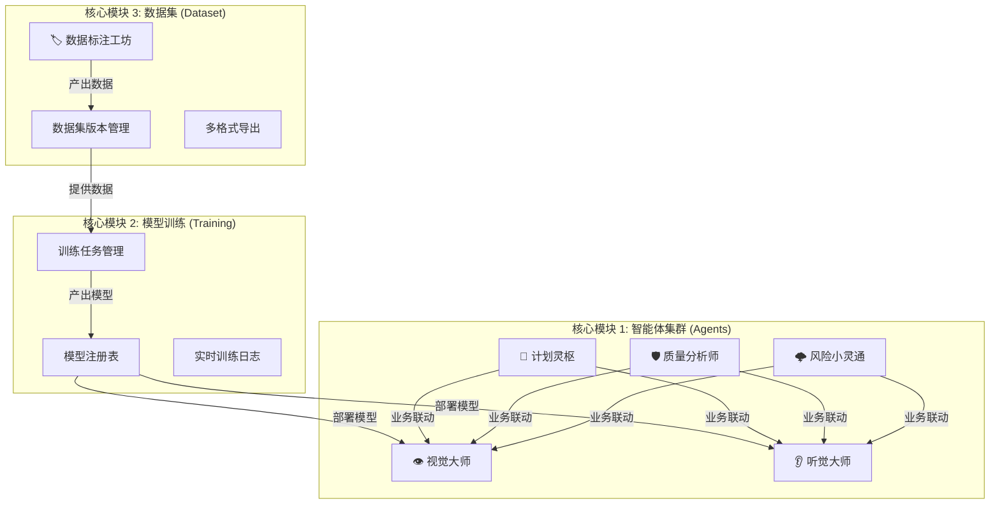

# 🤖 智能体协作平台 (Agentic Collaboration Platform)

> **版本 (Version):** v3.3
> **状态 (Status):** 🚀 生产就绪 (Production Ready)

本平台采用**三大核心模块架构**，实现了从数据生产、模型训练到智能体应用的全链路闭环。

---

## 🏛️ 核心架构概览 (Core Architecture)

平台由以下三个顶级模块构成：

1.  **智能体集群 (Intelligent Agent Cluster)**: 5大业务智能体，负责具体的业务逻辑与交互。
2.  **模型训练中心 (Model Training Center)**: 负责算法模型的全生命周期管理。
3.  **数据集中心 (Dataset Center)**: 负责数据标注、管理与版本控制。



---

## 📂 目录结构与实现方案 (Implementation Scheme)

代码库结构严格对应三大架构模块，确保高内聚低耦合。

### 模块一：智能体集群 (Agent Cluster)
负责感知、决策与执行的业务闭环。

- **前端实现 (Frontend)**: `components/agents/`
  - 👁️ `VisionAgent.tsx`: 视觉检测交互主界面
  - 👂 `AudioAgent.tsx`: 音频波形渲染与诊断面板
  - 📅 `PlanAgent.tsx`: 供应链甘特图与MRP计算
  - 🛡️ `QualityAgent.tsx`: 质量流程 (Hold/CR/QR) 管理
  - 🌩️ `RiskAgent.tsx`: 供应链风险地图渲染

- **后端微服务 (Microservices)**:
  - 👁️ `model/server.py`: **视觉推理服务** (YOLOv8/11, Port 5000)
  - 👂 `training/audio_detection_server.py`: **音频算法服务** (Ensemble, Port 5003)
  - 🧠 `training/llm_analysis_server.py`: **认知中台服务** (LLM Gateway, Port 5004)

### 模块二：模型训练中心 (Training Center)
负责模型的持续学习与迭代。

- **前端组件**: `components/training/`
  - `TrainingQueue.tsx`: 训练任务队列视窗
  - `TrainingVisualization.tsx`: 实时 Loss/mAP 曲线
  
- **后端核心**: `training/`
  - `train_server.py`: **训练管理服务** (Port 5001)，负责任务调度
  - `train_pipeline.py`: 封装 Ultralytics 训练流水线
  - `models_registry.json`: 模型版本与元数据注册表

### 模块三：数据集中心 (Dataset Center)
负责高质量数据的生产与沉淀。

- **前端组件**:
  - `components/agents/DataAnnotationAgent.tsx`: 标注工作台入口
  - `components/DataAnnotation/`: 标注工具底层组件 (Canvas, Tools)
  - `services/exportUtils.ts`: 数据格式转换逻辑 (COCO/YOLO/VOC)

- **后端核心**:
  - `training/dataset_server.py`: **数据集服务** (Port 5002)，负责文件系统管理

---

## 模块功能详解

### 1. 👁️ 视觉大师 (Vision Agent)
- **定位**: 工业外观质检专家。
- **能力**: 基于 YOLOv8/v11 的实时缺陷检测。
- **场景**: 漆面划痕、凹坑、异物检测。
- **交互**: 支持摄像头实时流与批量图片上传检测。

### 2. 👂 听觉大师 (Audio Agent)
- **定位**: 设备故障诊断专家。
- **能力**: 基于集成学习 (Ensemble Learning) 的异响检测。
- **场景**: 工业设备运转噪音分析、NVH 评估。
- **特性**: 实时波形显示与异常评分 (0-100)。

### 3. 📅 计划灵枢 (Plan Agent)
- **定位**: 供应链排程专家。
- **能力**: 智能 MPS (主生产计划) 与 MRP (物料需求计划) 计算。
- **特性**: 
    - 产线甘特图可视化。
    - 缺料自动预警。
    - 交互式催单与排程调整。

### 4. 🛡️ 质量分析师 (Quality Agent)
- **定位**: 全流程质量管控专家。
- **能力**: 质量数据的深度分析与流程管理。
- **特性**:
    - **Hold 管理**: 异常批次的冻结与释放。
    - **CR/QR 管理**: 客户投诉与质量风险的 8D 闭环跟踪。
    - **供应商画像**: 基于质量表现的动态评级。

### 5. 🌩️ 风险小灵通 (Risk Agent)
- **定位**: 供应链风控专家。
- **能力**: 全球供应链风险监控与 BIA (业务影响分析)。
- **特性**: 
    - **GIS 风险地图**: 可视化展示 T1-T3 供应商分布与风险点。
    - **多维预警**: 涵盖经营、质量、地缘、灾害四类风险。

---

## 🚀 快速启动 (Quick Start)

```bash
chmod +x start.sh
./start.sh
```

**服务清单**:
- **前端门户**: `http://localhost:3000`
- **视觉推理**: `:5000`
- **训练服务**: `:5001`
- **数据服务**: `:5002`
- **音频服务**: `:5003`
- **认知中台**: `:5004` (为 Plan/Quality/Risk 提供 LLM 支持)

---

## 📄 License
Internal Use Only.
